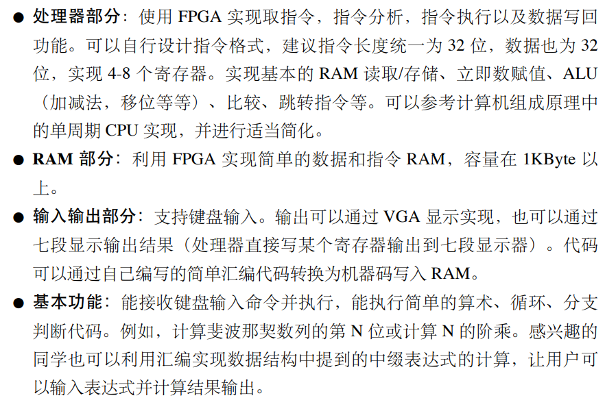
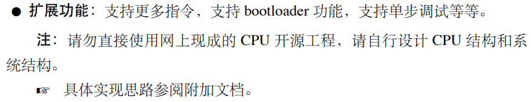
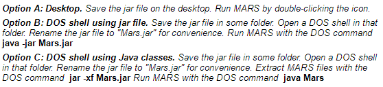

# ComputerSystem

## 简介

这是数字电路与数字系统实验的最后一次大实验，形式是小组合作，我们的课题是制作简单计算机系统。

## 要求

## 工作小组

* 许希帆（CPU、ALU等）
* 张宇晨（操作接口与软件）
* 马英硕（外设与拓展）

## 实验工具与文档说明

### 汇编代码生成工具

* Mars 4.5 编译器 (Aug. 2014)
  * 位置：tools/Mars4_5.jar
  * 使用环境要求：安装Java SE (Java Platform，Standard Edition) SDK
    
  * 使用方式：双击.jar文件
    

### MIPS汇编代码参考博客

#### 原理

#### 指令集 (31条)

### CPU参考博客

## 项目结构

项目结构标准如下：

1. **请在写代码的时候尽可能采取类似这种结构的划分**，这会使代码更清晰；

   

2. 请尽可能在`project/init_files`目录下放置初始化文件，如出现问题可以例外说明；

3. `report`文件夹：实验报告；

4. `manual`文件夹：使用手册，建议把自己的那部分先简单写一下；

5. `docs`文件夹：参考文档

   1. `EPCS编程.pdf`：DE10-Standard EPCS编程教程文档；
   2. `computer_system.pdf`：实验实现参考文档；
   3. `exp12.pdf`：课程大实验要求文档。

6. `tools`文件夹：工具程序等。
